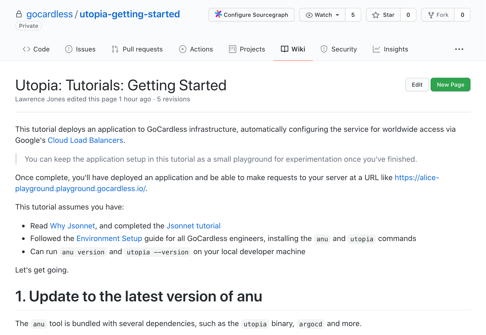

# Utopia: Tutorials: Getting started

[page]: https://github.com/gocardless/utopia-getting-started/wiki/Utopia:-Tutorials:-Getting-Started

This repo hosts a wiki page, [Utopia: Tutorials: Getting Started][page], which
is a copy of the tutorial we ask GoCardless engineers to complete as part of
their onboarding.

> **See the associated blog post here: https://medium.com/gocardless-tech/gocardless-getting-started-infrastructure-tutorial-ab857aa91c9e**

The tutorial is part of documentation for utopia, a tool and associated
configuration libraries that GoCardless use to manage their infrastructure. It
is a work in progress, and changing continuously.

Utopia has several aims:

- Developers should be able to self-service all common operations
- Only production environments require change-control, to ease experimentation
- It is easy to understand the effect a change will have once deployed
- Any configuration should be schema'd, documented, and verifiable

As a new joiner following the tutorial, it helps setup a web server inside a
playground Kubernetes cluster, which can be curled from their own laptop.

If you have questions about this content, just tweet us at
[@GoCardlessEng](https://twitter.com/GoCardlessEng). We'll be happy to answer!

[][page]
